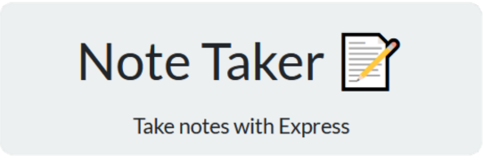
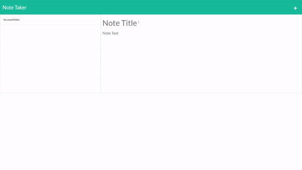

  

<h3 align="center">Pro Note Taker</h3>

---

 Your personalized and polished user interface for note-taking!
      

## 

- [About](#about)
- [Installing](#installing)
- [Usage](#usage)
- [Built With](#built_using)
- [Authors](#authors)
- [Questions](#questions)

## 

This repository is where I ([Rae Alejandrino](https://github.com/raealejandrino/)) develop a fully functioning note taker application using Node and Express. Whether you're looking to write a quick reminder, or study a live lecture, Pro Note Taker can help your productivity with digital note-taking! 

## 

Once you have cloned the repo down from GitHub, you will want to run `npm install` in the command line to install all of the Node Modules needed to run the application.

## 

In order to run this program locally you will need to:

1. Clone this repository to receive all the files.
2. Run `npm install` in the terminal to download all the needed dependencies (makes sure you are in the correct file directory).
3. Run `npm start` in the terminal to start a live server locally.
4. Open your browser and connect to 'http://localhost:3001/' in the address bar.
5. Click on the "Get Started" button to arrive at the note-taking interface.

## 

- JavaScript
- Node.js
- Express.js
- HTML
- CSS / Bootstrap

## 

- [@raealejandrino](https://github.com/raealejandrino) - Backend functionality
- See also the list of [contributors] (https://github.com/coding-boot-camp/miniature-eureka/graphs/contributors) who participated in this project.

## 

- Feel free to open an issue or contact me directly at raealejandrino@gmail.com if you have any questions about the repo. You can find more of my work at [raealejandrino](https://github.com/raealejandrino/).
